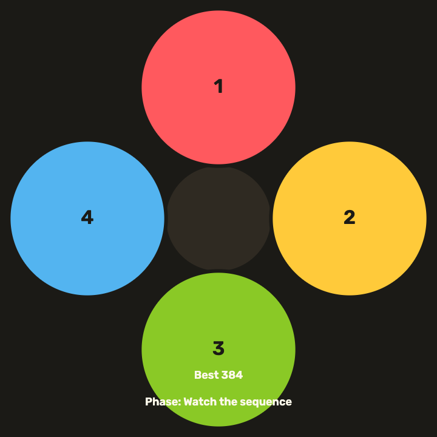

# daily-classic-game-2026-02-24-simon-says-speed-increments

<div align="center">
  <p><strong>Memorize the pattern, repeat it exactly, and survive the tempo ramp.</strong></p>
</div>

<div align="center">
  
</div>

<div align="center">
  
</div>

<div align="center">
  <a href="https://daily-classic-game-2026-02-24-simon-says-speed-increments.vercel.app"><strong>Play Live on Vercel</strong></a>
</div>

## Quick Start

```bash
pnpm install
pnpm dev
```

## How To Play
- Press `Start` (or `Enter`) and watch the full sequence first.
- Wait until HUD phase shows `Input`, then replay the pattern in exact order.
- Use mouse clicks or keys `1` `2` `3` `4` for pad input.
- Press `P` to pause/resume and `R` to restart at any time.
- Keep your browser tab audible: the game plays pad tones and feedback cues.
- If audio is muted by browser policy, click inside the game once to enable sound.

## Rules
- Input is valid only during the `Input` phase.
- Every round appends one new pad to the sequence.
- You must match every step in order; partial correctness does not clear a round.
- One wrong step immediately ends the run and shows the expected vs received pad.
- Tempo increases each round, reducing show/gap timing and raising difficulty.

## Scoring
- Round clear bonus: `round_score = round(100 * tempo + round * 10)`.
- Higher tempo rounds yield larger score gains.
- `Best` tracks your highest score for the current browser session.

## Twist
The playback tempo speeds up after every successful round, compressing flash and gap timing. Faster rounds are worth more points.

## Verification

```bash
pnpm test
pnpm build
```

## Project Layout
- `index.html`: Canvas shell and overlays.
- `src/main.js`: Game loop, explicit phase rules, scoring, and sound cues.
- `src/style.css`: Visual styling and layout.
- `assets/images/`: Hero still image for README/About.
- `assets/gifs/`: Real gameplay GIF captures.
- `docs/plans/`: Implementation planning notes.

## GIF Captures
- Intro loop: `assets/gifs/clip-1-intro.gif`
- Tempo ramp: `assets/gifs/clip-2-speedup.gif`
- Missed input: `assets/gifs/clip-3-miss.gif`
