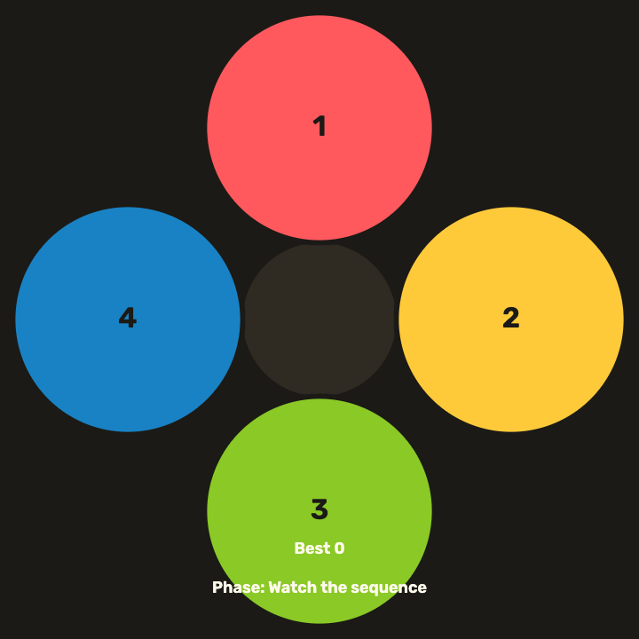

# daily-classic-game-2026-02-24-simon-says-speed-increments

<div align="center">
  <p><strong>Memorize the glowing pad sequence, then repeat it as the tempo accelerates every round.</strong></p>
</div>

<div align="center">
  
</div>

## Quick Start

```bash
pnpm install
pnpm dev
```

## How To Play
- Watch the pads light up in order.
- Click the pads or press `1`-`4` to repeat the sequence.
- Press `P` to pause and `R` to restart.

## Rules
- A round is cleared when you match the entire sequence.
- A wrong input ends the run.
- Each round adds one new step to the sequence.

## Scoring
- Score increases when you complete a round.
- Higher tempo rounds award larger bonuses.
- Best score persists during the session.

## Twist
The playback tempo speeds up after every successful round, compressing flash and gap timing. Faster rounds are worth more points.

## Verification

```bash
pnpm test
pnpm build
```

## Project Layout
- `index.html`: Canvas shell and overlays.
- `src/main.js`: Game loop, input, and rendering.
- `src/style.css`: Visual styling and layout.
- `assets/gifs/`: Capture placeholders for gameplay clips.
- `docs/plans/`: Implementation planning notes.

## GIF Captures
- Intro loop: `assets/gifs/clip-1-intro.gif`
- Tempo ramp: `assets/gifs/clip-2-speedup.gif`
- Missed input: `assets/gifs/clip-3-miss.gif`
